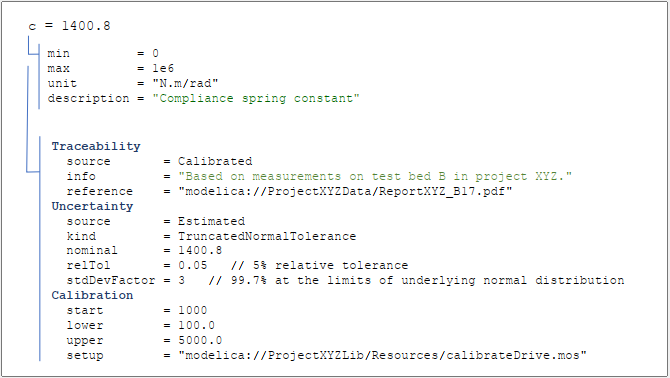

# Credibility

Package Credibility is a free Modelica package to add traceability, uncertainty and calibration information to scalar and 1D-table parameters in a standardized way. For details of this library, see also the journal article [Towards Modelica Models with Credibility Information](https://doi.org/10.3390/electronics11172728).

Example for the kind of information that can be added to a scalar parameter value (image is from the article above):

## Main Developers

[Martin Otter](https://rmc.dlr.de/sr/en/staff/martin.otter/), Matthias Reiner, Jakub Tobolar,
[DLR - Institute of System Dynamics and Control](https://www.dlr.de/sr/en).

## Acknowledgement

The development of the Library was organized within the European ITEA3 Call6 project [UPSIM](https://www.upsim-project.eu/) – Unleash Potentials in Simulation (number 19006).The work was partially funded by the German Federal Ministry of Education and Research (BMBF, grant numbers 01IS20072H and 01IS20072G).

The development of this library is based on work carried out together with Leo Gall and Matthias Schäfer (both [LTX Simulation GmbH](https://www.ltx.de/english.html)) in the UPSIM project.
